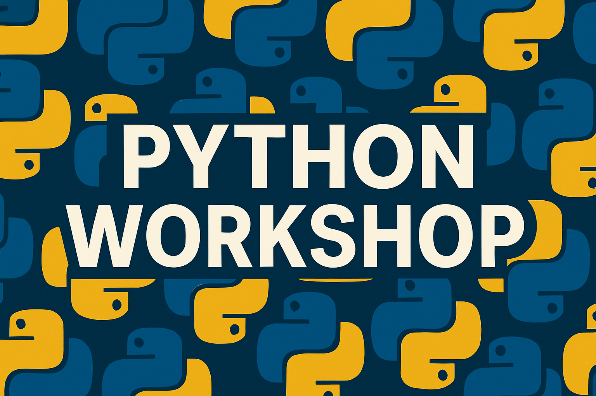

  

## Introduction to Python

This workshop includes both slide decks for presentation and Jupyter notebooks for hands-on practice with Google Colab and Gemini. The notebooks include example code and self-grading exercises.

::: {.columns}
::: {.column}

### Slide Decks

- [Part 1: Colab](slides/part1_colab_slides.html)
- [Part 2: Objects](slides/part2_objects_slides.html)
- [Part 3: Lists](slides/part3_lists_slides.html)
- [Part 4: Dictionaries](slides/part4_dictionaries_slides.html)
- [Part 5: Flow Control](slides/part5_flow_control_slides.html)
- [Part 6: Functions](slides/part6_functions_slides.html)
- [Part 7: Libraries](slides/part7_libraries_slides.html)
- [Part 8: Intro to Pandas](slides/part8_pandas_intro_slides.html)
- [Part 9: More Pandas](slides/part9_pandas_more_slides.html)
- [Part 10: Intro to Visualization](slides/part10_visualization_intro_slides.html)
- [Part 11: More Visualization](slides/part11_visualization_more_slides.html)
- [Part 12: Plotly](slides/part12_visualization_plotly_slides.html)
- [Part 13: Simulation](slides/part13_simulation_slides.html)
- [Part 14: Goal Seek](slides/part14_goal_seek_slides.html)
- [Part 15: Neural Networks](slides/part15_neural_networks_slides.html)

:::

::: {.column}

### Hands-On Exercises

**[Workshop Exercise Notebook](https://colab.research.google.com/github/kerryback/workshop_python/blob/main/python_workshop_exercises.ipynb)**

This single notebook contains ~35 self-graded exercises organized by workshop parts (1-15). Each exercise:

- Reinforces concepts from the slides
- Includes self-grading code with feedback
- Has Gemini hints for harder problems
- Can be completed during workshop sessions

**Features:**
- ✓ Aligned with slide content
- ✓ Minimal explanations (slides teach, notebook practices)
- ✓ Progressive difficulty
- ✓ Works standalone in Google Colab

:::
:::

## Additional Resources

Here are some additional online resources for learning Python.

#### Quick References
- [Python Tutor](http://pythontutor.com/) - Visualize code execution step-by-step
- [Python Cheat Sheet](https://www.python-cheatsheet.org/) - Concise syntax reference
- [Real Python's Python Tricks](https://realpython.com/python-tricks/) - Short, digestible articles
- [Python Graph Gallery](https://python-graph-gallery.com/) - Simple plotting examples with matplotlib

#### Online Practice Platforms

- [HackerRank Python Domain](https://www.hackerrank.com/domains/python) - Basic problems like "Hello World", simple math, string manipulation
- [Codewars 8 kyu Python Problems](https://www.codewars.com/kata/search/python?q=&r%5B%5D=-8&tags=Fundamentals&beta=false) - Easiest level problems
- [Codewars 7 kyu Python Problems](https://www.codewars.com/kata/search/python?q=&r%5B%5D=-7&tags=Fundamentals&beta=false) - Slightly more challenging
- [LeetCode Easy Python Problems](https://leetcode.com/problemset/all/?difficulty=Easy&listId=wpwgkgt) - Filter by Python and "Easy" difficulty

#### Great Books

- [Python for Data Analysis (3rd Edition)](https://wesmckinney.com/book/) by Wes McKinney - The definitive guide to data manipulation with Python, pandas, and NumPy
- [Automate the Boring Stuff with Python](https://automatetheboringstuff.com/) - Practical programming for total beginners

#### More Notebooks for Learning Python

- [Learn to Code Python](https://colab.research.google.com/github/ryanorsinger/learn-to-code-python-workshop/blob/main/intro-to-python.ipynb)
- [101 Exercises](https://colab.research.google.com/github/ryanorsinger/101-exercises/blob/main/101-exercises.ipynb)
- [Python Programming Exercises (100+ exercises)](https://colab.research.google.com/github/zhiwehu/Python-programming-exercises/blob/master/)
- [100 Days of Python Course](https://colab.research.google.com/github/talkpython/100daysofcode-with-python-course/blob/master/)
- [100+ Python Programming Exercises Extended](https://colab.research.google.com/github/darkprinx/100-plus-Python-programming-exercises-extended/blob/master/)
- [Learn Python 3 Interactive Notebooks](https://colab.research.google.com/github/jerry-git/learn-python3/blob/master/)
- [Tiny Python Projects](https://colab.research.google.com/github/kyclark/tiny_python_projects/blob/master/)
- [Practical Python Programming Course](https://colab.research.google.com/github/dabeaz-course/practical-python/blob/master/)
- [A Gallery of Interesting Jupyter Notebooks](https://github.com/jupyter/jupyter/wiki/A-gallery-of-interesting-Jupyter-Notebooks) - Curated collection of educational notebooks