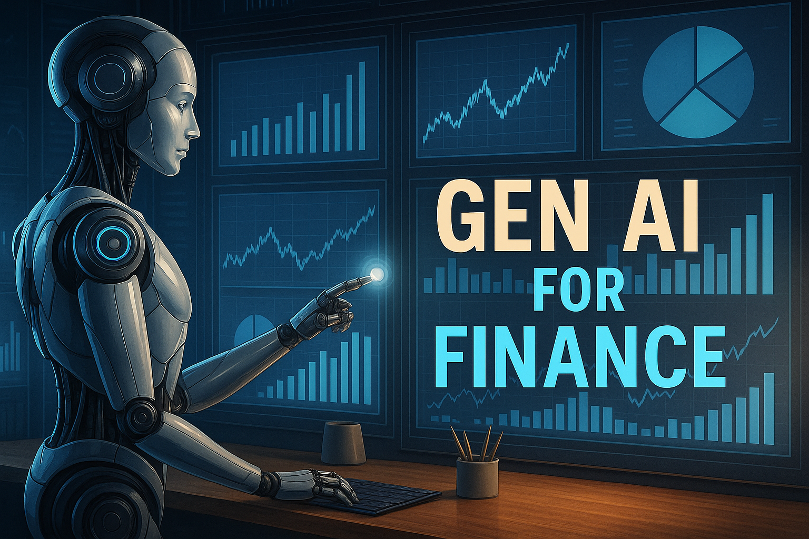

  

## Introduction to Python Notebooks

This is a set of notebooks designed to teach Python with the aid of Google Colab and Gemini.  The notebooks will automatically open in Colab.  They explain Python concepts and include example code and self-grading exercises.  The first notebook provides some instruction on how to use Google Colab.

::: {.columns}
::: {.column}

- [Part 1: Colab](https://colab.research.google.com/github/kerryback/workshop/blob/main/notebooks/part1_colab.ipynb)
- [Part 2: Objects](https://colab.research.google.com/github/kerryback/workshop/blob/main/notebooks/part2_objects.ipynb)
- [Part 3: Lists, etc.](https://colab.research.google.com/github/kerryback/workshop/blob/main/notebooks/part3_lists_dictionaries.ipynb)
- [Part 4: Flow Control](https://colab.research.google.com/github/kerryback/workshop/blob/main/notebooks/part4_flow_control.ipynb)
- [Part 5: Functions](https://colab.research.google.com/github/kerryback/workshop/blob/main/notebooks/part5_functions.ipynb)
- [Part 6: Libraries](https://colab.research.google.com/github/kerryback/workshop/blob/main/notebooks/part6_libraries.ipynb)
- [Part 7: Intro to Pandas](https://colab.research.google.com/github/kerryback/workshop/blob/main/notebooks/part7_pandas_intro.ipynb)
:::

::: {.column}

- [Part 8: More Pandas](https://colab.research.google.com/github/kerryback/workshop/blob/main/notebooks/part8_pandas_more.ipynb)
- [Part 9: Intro to Visualization](https://colab.research.google.com/github/kerryback/workshop/blob/main/notebooks/part9_visualization_intro.ipynb)
- [Part 10: More Visualization](https://colab.research.google.com/github/kerryback/workshop/blob/main/notebooks/part10_visualization_more.ipynb)
- [Part 11: Plotly](https://colab.research.google.com/github/kerryback/workshop/blob/main/notebooks/part11_visualization_plotly.ipynb)
- [Part 12: Simulation](https://colab.research.google.com/github/kerryback/workshop/blob/main/notebooks/part12_simulation.ipynb)
- [Part 13: Goal Seek](https://colab.research.google.com/github/kerryback/workshop/blob/main/notebooks/part13_goal_seek.ipynb)
- [Part 14: Neural Networks](https://colab.research.google.com/github/kerryback/workshop/blob/main/notebooks/part14_neural_networks.ipynb)

:::
:::

## Additional Resources

Here are some additional online resources for learning Python.

#### Quick References
- [Python Tutor](http://pythontutor.com/) - Visualize code execution step-by-step
- [Python Cheat Sheet](https://www.python-cheatsheet.org/) - Concise syntax reference
- [Real Python's Python Tricks](https://realpython.com/python-tricks/) - Short, digestible articles
- [Python Graph Gallery](https://python-graph-gallery.com/) - Simple plotting examples with matplotlib

#### Online Practice Platforms

- [HackerRank Python Domain](https://www.hackerrank.com/domains/python) - Basic problems like "Hello World", simple math, string manipulation
- [Codewars 8 kyu Python Problems](https://www.codewars.com/kata/search/python?q=&r%5B%5D=-8&tags=Fundamentals&beta=false) - Easiest level problems
- [Codewars 7 kyu Python Problems](https://www.codewars.com/kata/search/python?q=&r%5B%5D=-7&tags=Fundamentals&beta=false) - Slightly more challenging
- [LeetCode Easy Python Problems](https://leetcode.com/problemset/all/?difficulty=Easy&listId=wpwgkgt) - Filter by Python and "Easy" difficulty

#### Great Books

- [Python for Data Analysis (3rd Edition)](https://wesmckinney.com/book/) by Wes McKinney - The definitive guide to data manipulation with Python, pandas, and NumPy
- [Automate the Boring Stuff with Python](https://automatetheboringstuff.com/) - Practical programming for total beginners

#### Jupyter Notebooks 

- [Learn to Code Python](https://colab.research.google.com/github/ryanorsinger/learn-to-code-python-workshop/blob/main/intro-to-python.ipynb)
- [101 Exercises](https://colab.research.google.com/github/ryanorsinger/101-exercises/blob/main/101-exercises.ipynb)
- [Python Programming Exercises (100+ exercises)](https://colab.research.google.com/github/zhiwehu/Python-programming-exercises/blob/master/)
- [100 Days of Python Course](https://colab.research.google.com/github/talkpython/100daysofcode-with-python-course/blob/master/)
- [100+ Python Programming Exercises Extended](https://colab.research.google.com/github/darkprinx/100-plus-Python-programming-exercises-extended/blob/master/)
- [Learn Python 3 Interactive Notebooks](https://colab.research.google.com/github/jerry-git/learn-python3/blob/master/)
- [Tiny Python Projects](https://colab.research.google.com/github/kyclark/tiny_python_projects/blob/master/)
- [Practical Python Programming Course](https://colab.research.google.com/github/dabeaz-course/practical-python/blob/master/)
- [A Gallery of Interesting Jupyter Notebooks](https://github.com/jupyter/jupyter/wiki/A-gallery-of-interesting-Jupyter-Notebooks) - Curated collection of educational notebooks